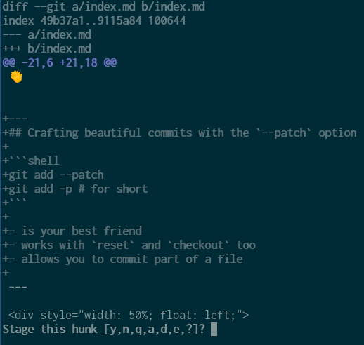
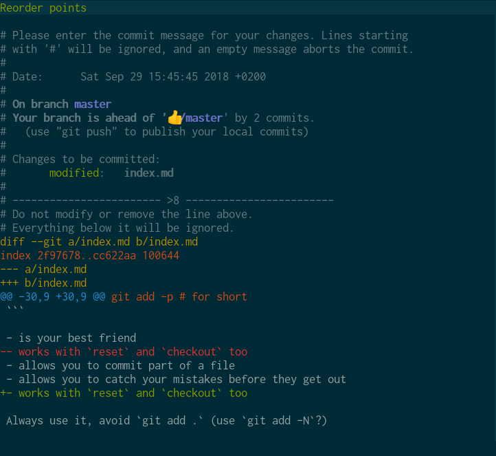
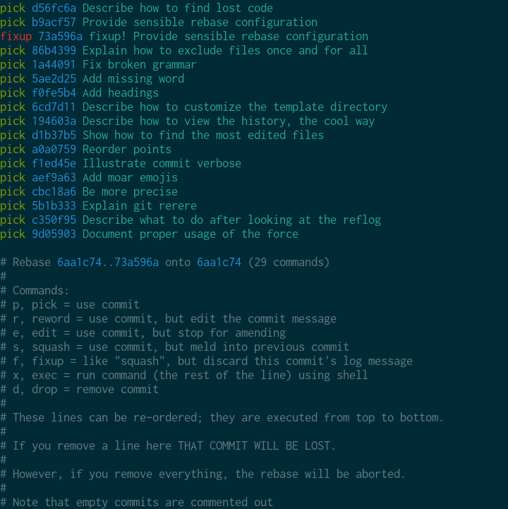

# Git Gud

---
<!-- .slide: id="hello" -->
## Hi!

<div>
  <span id="gregoire"></span><br />
  **Grégoire PARIS**<br />
  <span class="job">
  Software Engineer @ ManoMano<br />
  </span>
</div>

---


- **Linus Torvald's** 2005 side project, "named" after him 😁
- Maintained by **Junio C Hamano** a.k.a. gitster

👏


---
## Committing hunks of patch

```shell
git add --patch
git add -p # for short
```

- is your best friend
- allows you to commit part of a file
- allows you to catch your mistakes before they get out
- works with `reset` and `checkout` too

Always use it, avoid `git add .` (use `git add -N`?)

---
## Committing hunks of patch



---
## Reviewing one more time

```shell
git commit --verbose
git commit -v # for short
```

- is your second best friend
- another chance to catch your mistakes before they get out

---
## Reviewing one more time



---
## Writing a good commit message: the format 📝

```shell
git commit -m "This is the worst possible way to commit" # do not do this
```

- first line is the subject and should be less than 50 chars
- second line is _streng verboten_ ⛔
- write a paragraph (the commit body) below, wrap it at 72 chars

Use vim, it enforces it!

```shell
git config --global core.editor "vim"
```

---
## Writing a good commit message: the contents 📜

The commit message subject:

- should be about *what* you did
- completes "If applied, this commit will…"
- should not depend on JIRA or any other online resource

---
## Writing a good commit message: the contents 📜

The commit message body:

- should explain *why* you did what you did
- should sum up lengthy Git{hub,lab} / Bitbucket discussions
- may reference external bugtrackers, *as a bonus*
- may be the place to explain technical choices

---
## Writing a bad commit message: the GitHub UI user

`Update src/App/Entity/User.php`

- don't use the web UI
- organize a mass protest to change GitHub's behavior


---
## Writing a bad commit message: the bug fixer


---
## Proving your innocence: bisection 👼

```shell
git bisect start
git bisect bad
git checkout ancient-commit
git bisect good
git bisect [good|bad|skip]
git bisect [good|bad|skip]
…
git bisect reset
```

- rarely needed
- very useful in dire situations
- is a good reason to write short commits

---
## Avoiding (git) conflicts 💥

They happen when several people change the same file.

- when in doubt, use alphabetical order
- respect the Open/Close Principle
- write short lines (< 80 - 120 chars)

Finding the most edited files:
```shell
git log --pretty=format: --name-only | sort | uniq -c | sort -rg | head -10
```

---
## Finding the culprit 🔍

```shell
git blame path/to/file/with/an/issue.php # the "I'm feeling lucky" way
git log -S 'var_dump' -p # the accurate way
```


---
## How to avoid committing on the master branch

```shell
git branch -d master
```
Need to test something on "master"?
```
git checkout origin/master
```

---
## Basic hygiene 🚿

```shell
git fetch --prune
git branch --merged origin/master | xargs git branch -d
```

---
## Undoing a catastrophic failure 💀

```
git reflog --date=iso
```

---
## Understanding `checkout`'s "inconsistent" API

```shell
git checkout 💩 # resets the working tree to that branch
git checkout README.md # forgets about changes in README.md 😕
git checkout 💩 README.txt # sets README.md to what it looks like in 💩
```

💡

```shell
git checkout 💩 # shortcut for git checkout 💩 .
git checkout README.md # shortcut for git checkout HEAD README.md
```

---
## Rebasing with ease

```shell
git config --global rebase.autostash true
git config --global rebase.autosquash true
git commit --fixup b9acf57
git rebase --interactive 6aa1c74 # git rebase -i for short
```


---
## Excluding files globally


```shell
git config --global core.excludesfile ~/.gitignore_global
echo ".DS_STORE_OR_WHATEVER_IT_IS" >> ~/.gitignore_global
```

---
## Customizing the template directory

```shell
git config --global init.templatedir ~/path/to/my/templatedir
```

- On my system, defaults to `/usr/share/git-core/templates`
- I wrote an entire project about this, check it out: http://git-template.readthedocs.io

---
## Viewing your history, the cool way 😎

```shell
gource
```


---

<div style="width: 50%; float: left;">
<h1>Thanks!</h1>
</div>
<div>
  <p>Grégoire Paris</p>
  <p> greg0ire</p>
</div>
