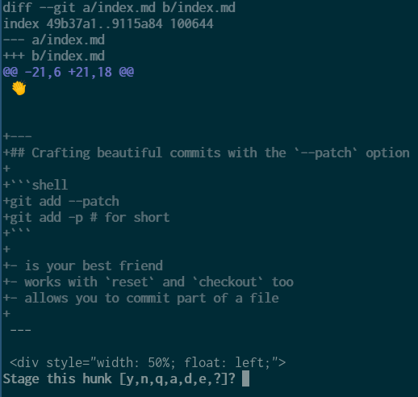
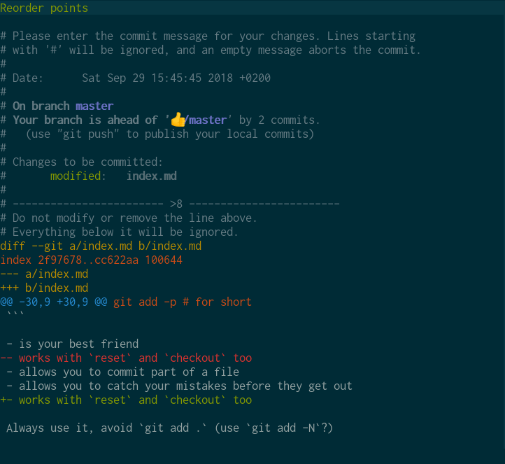
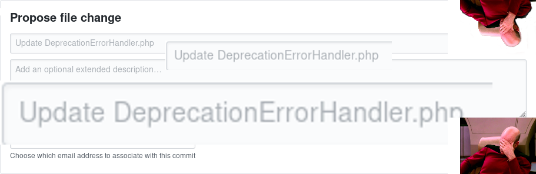
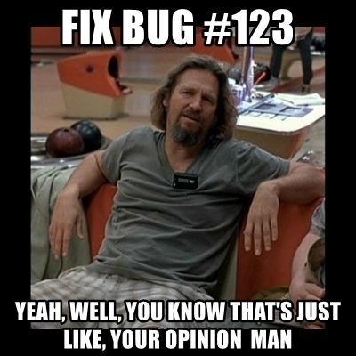
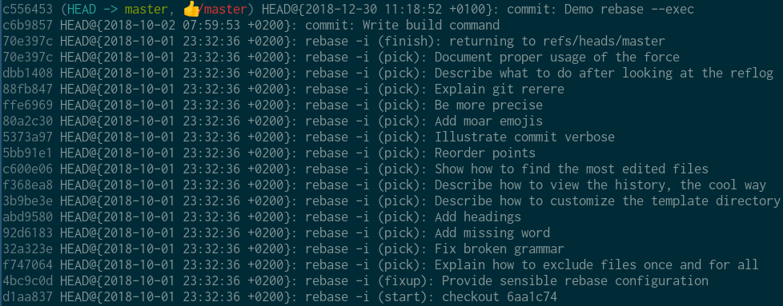
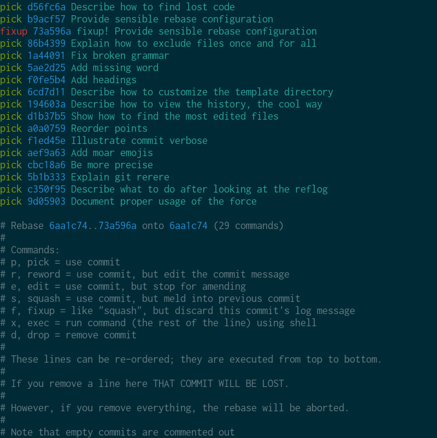
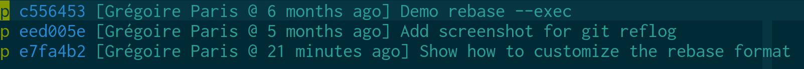
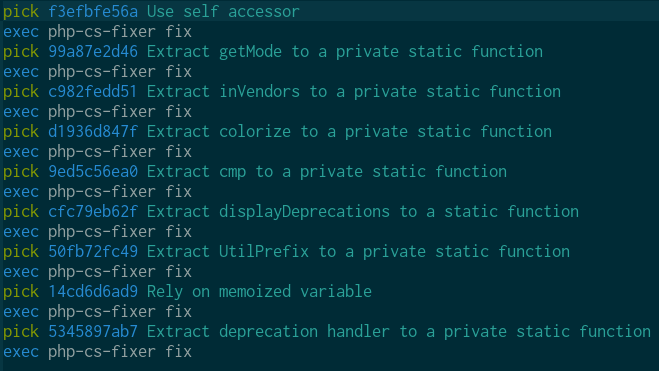

# Git Gud

---
<!-- .slide: id="hello" -->
## Hi!

<br />
**Grégoire PARIS**<br />
Software Engineer @ ManoMano<br />

---


- **Linus Torvald's** 2005 side project, "named" after him 😁
- Maintained by **Junio C Hamano** a.k.a. gitster

👏


---
## Committing hunks of patch

```shell
git add --patch
git add -p # for short
```

- is your best friend
- allows you to commit part of a file
- allows you to catch your mistakes before they get out
- works with `reset` and ~~`checkout`~~`restore` too

Always use it, avoid `git add .` (use `git add -N`?)

---
## Committing hunks of patch



---
## Reviewing one more time

```shell
git commit --verbose
git commit -v # for short
git config --global commit.verbose true # to adopt it forever
```

- is your second best friend
- another chance to catch your mistakes before they get out

---
## Reviewing one more time



---
## Writing a good commit message: the format 📝

```shell
git commit -m "This is the worst possible way to commit" # do not do this
```

It should look like an e-mail 📧

- first line is the subject and should be less than 50 chars
- second line is _streng verboten_ ⛔
- write a paragraph (the commit body) below, wrap it at 72 chars

Use vim, it enforces it!

```shell
git config --global core.editor "vim"
```

---
## Writing a good commit message: the contents 📜

The commit message *subject*:

- should be about *what* you did
- completes "If applied, this commit will…"
- should not depend on JIRA or any other online resource (you only have 50 chars!)

---
## Writing a good commit message: the contents 📜

The commit message *body*:

- should explain *why* you did what you did
- should sum up lengthy Git{hub,lab} / Bitbucket discussions
- may reference external bugtrackers, *as a bonus*
- may be the place to explain technical choices

---
## Writing a bad commit message: the GitHub UI user



- don't use the web UI
- organize a mass protest to change GitHub's behavior


---
## Writing a bad commit message: the bug fixer



---
## Using the force ✋

```
git commit --amend
git push --force-with-lease
```

---
## Proving your innocence: bisection 👼

```shell
git bisect start
git bisect bad
git switch --detach ancient-commit
git bisect good
git bisect [good|bad|skip]
git bisect [good|bad|skip]
git bisect visualize # uses gitk 🤮
…
git bisect reset
```

- rarely needed
- very useful in dire situations
- is a good reason to write short commits

---
## Avoiding (git) conflicts 💥

They happen when several people change the same file around the same line.

- when in doubt, use alphabetical order
- respect the Open/Close Principle
- write short lines (< 80 - 120 chars)

Finding the most edited files:
```shell
git log --pretty=format: --name-only | sort | uniq -c | sort -rg | head -10
```

---
## Finding the culprit 🔍

```shell
git blame path/to/file/with/an/issue.php # the "I'm feeling lucky" way
git log -S 'var_dump' -p # the accurate way
```


---
## How to avoid committing on a protected branch

```shell
git branch -d main
```
Need to start a new branch?
```shell
git switch --create new-branch origin/main
```
Need to test something on "main"?
```shell
git switch --detach origin/main # -d for short
```

---
## Basic hygiene 🚿

```shell
# prune remote branches that are gone
git fetch --prune

# do that by default
git config --global fetch.prune true

# delete branches that are merged in origin/main
git branch --merged origin/main | xargs git branch -d

# delete branches that had an upstream branch in the past, but no longer do
git branch -v|grep -F '[gone]'|cut --field 3 --delimiter ' '|xargs git branch -D
```

---
## Undoing a catastrophic failure 💀

```
git reflog --date=iso
git show 2efadeb
git reset --hard 2efadeb
```


---
## Understanding `checkout`'s "inconsistent" API

```shell
git checkout my-branch # resets the working tree to that branch
git checkout README.md # forgets about changes in README.md 😕
git checkout my-branch README.txt # sets README.md to what it looks like in my-branch
```

💡

```shell
git checkout my-branch # shortcut for git checkout my-branch .
git checkout README.md # shortcut for git checkout HEAD README.md
```

🎉 Replaced with switch and restore in recent versions 🎉

```shell
git switch my-branch
git restore README.md # shortcut for git checkout HEAD README.md
```

---
## Rebasing with ease

```shell
git config --global rebase.autostash true
git config --global rebase.autosquash true
git commit --fixup b9acf57
git rebase --interactive b9acf57^1 # git rebase -i for short
```


---
## Customizing the format of git rebase --interactive

```shell
git config --global rebase.abbreviateCommands true
git config --global rebase.instructionFormat "[%an @ %ar] %s"
```


---
## Fixing coding standard issues properly

```shell
git rebase [--interactive] --exec "php-cs-fixer fix"
```


---
## Excluding files globally


```shell
git config --global core.excludesfile ~/.config/git/ignore
echo ".DS_STORE_OR_WHATEVER_IT_IS" >> ~/.config/git/ignore
```

---
## Customizing the template directory

```shell
git config --global init.templatedir ~/path/to/my/templatedir
```

- On my system, defaults to `/usr/share/git-core/templates`
- I wrote an entire project about this, check it out: http://git-template.readthedocs.io

---
## Reusing Recorded Resolutions of conflict merges

```shell
git config --global rerere.enabled true
```

---
## Viewing your history, the cool way 😎

```shell
gource
```


---

<div style="width: 50%; float: left;">
<h1>Thanks!</h1>
</div>
<div>
  <p>Grégoire Paris</p>
  <p> greg0ire@phpc.social</p>
</div>
