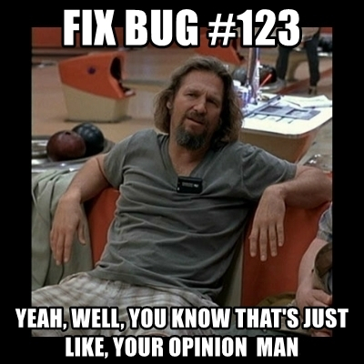

# Git Gud

---
<!-- .slide: id="hello" -->
## Hi!

<div>
  <span id="gregoire"></span><br />
  **Grégoire PARIS**<br />
  <span class="job">
  Software Engineer @ ManoMano<br />
  </span>
</div>

---


- **Linus Torvald's** side project
- Maintained by **Junio C Hamano** a.k.a. gitster

👏


---
## Committing hunks of patch

```shell
git add --patch
git add -p # for short
```

- is your best friend
- works with `reset` and `checkout` too
- allows you to commit part of a file
- allows you to catch your mistake before they get out

Always use it, avoid `git add .`

---
## Committing hunks of patch


---
## Reviewing one more time

```shell
git commit --verbose
git commit -v # for short
```

- is your second best friend
- another chance to catch your mistakes before they get out

---
## Writing a good commit message: the format

```shell
git commit -m "This is the worst possible way to commit" # do not do this
```

- first line is the subject should be less than 50 chars
- second line is _streng verboten_
- write a paragraph (the commit body) below, wrap it at 72 chars

Use vim, it enforces it!

```shell
git config --global core.editor "vim"
```

---
## Writing a good commit message: the contents

- should be about *what* you did
- completes "If applied, this commit will…"
- should not depend on JIRA or any other online resource

---
## Writing a good commit message: the contents

- should explain *why* you did what you did
- should sum up lengthy Git{hub,lab} / Bitbucket discussions
- may reference external bugtrackers, *as a bonus*
- may be the place to explain technical choices

---
## Writing a bad commit message: the GitHub UI user

`Update src/App/Entity/User.php`

- don't use the web UI
- organize a mass protest to change GitHub's behavior


---
## Writing a bad commit message: the bug fixer




---

<div style="width: 50%; float: left;">
<h1>Thanks!</h1>
</div>
<div>
  <p>Grégoire Paris</p>
  <p> greg0ire</p>
</div>
